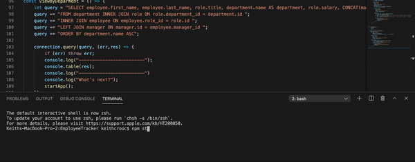

# EmployeeTracker
Using node.js, inquirer and MySQL to manage a company's employee structure.

## MySQL

This project runs on node, inquirer and MySQL that enables users to navigate and edit information within a database.

Users of this EmployeeTracker will be prompted a set of questions or options that will respond with the relevant information or action.
It'll either provide a particular way to view the all data of the Employee database or will prompt a process to create/edit/remove data.

A schema.sql is used to create the database in MySQL, while the seed.sql is used to populate it with data. The current data of Employees reflect characters of the popular sitcom "The Office".

**Here's a gif of navigating the database through the CLI:**

